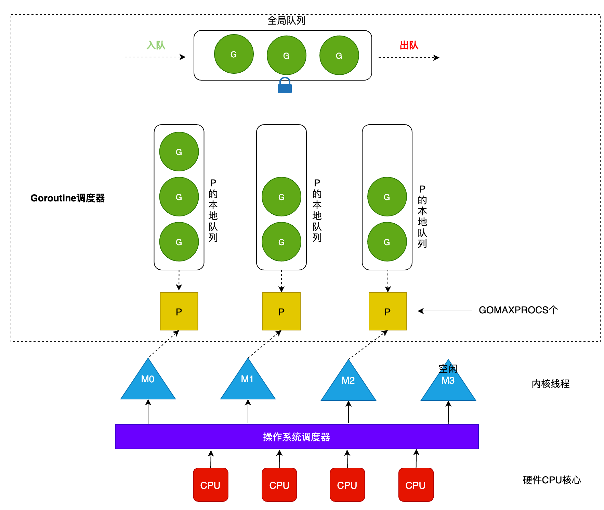
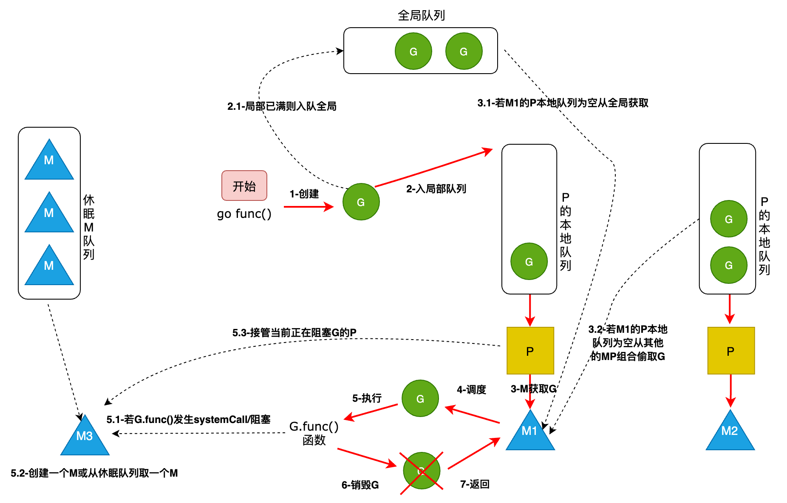
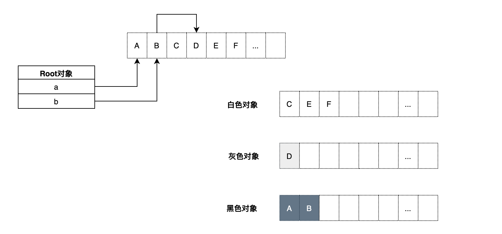

## 1. GMP 原理和调度

G-M-P 分别代表：

-   **G - Goroutine**，Go 协程，是参与调度与执行的最小单位
-   **M - Machine**，指的是系统级线程
-   **P - Processor**，指的是逻辑处理器，P 关联了的本地可运行 G 的队列（也称为 LRQ），最多可存放 256 个 G。

**GMP 调度流程大致如下：**

-   线程 M 想运行任务就需得获取 P，即与 P 关联。
-   然从 P 的本地队列(LRQ)获取 G
-   若 LRQ 中没有可运行的 G，M 会尝试从全局队列(GRQ)拿一批 G 放到 P 的本地队列，
-   若全局队列也未找到可运行的 G 时候，M 会随机从其他 P 的本地队列偷一半放到自己 P 的本地队列。
-   拿到可运行的 G 之后，M 运行 G，G 执行之后，M 会从 P 获取下一个 G，不断重复下去

### 1.1. G-M-P 的数量

-   G 的数量：
    理论上没有数量上限限制的。查看当前 G 的数量可以使用 `runtime. NumGoroutine()`
-   P 的数量：
    由启动时环境变量 `$GOMAXPROCS` 或者是由 `runtime.GOMAXPROCS()` 决定。这意味着在程序执行的任意时刻都只有 $GOMAXPROCS 个 goroutine 在同时运行。
-   M 的数量:
    go 语言本身的限制：go 程序启动时，会设置 M 的最大数量，默认 10000. 但是内核很难支持这么多的线程数，所以这个限制可以忽略。
    `runtime/debug` 中的 `SetMaxThreads` 函数，设置 M 的最大数量
    一个 M 阻塞了，会创建新的 M。M 与 P 的数量没有绝对关系，一个 M 阻塞，P 就会去创建或者切换另一个 M，所以，即使 P 的默认数量是 1，也有可能会创建很多个 M 出来。

### 1.2. 调度的流程状态

-   每个 P 有个局部队列，局部队列保存待执行的 goroutine(流程 2)，当 M 绑定的 P 的的局部队列已经满了之后就会把 goroutine 放到全局队列(流程 2-1)
-   每个 P 和一个 M 绑定，M 是真正的执行 P 中 goroutine 的实体(流程 3)，M 从绑定的 P 中的局部队列获取 G 来执行
-   当 M 绑定的 P 的局部队列为空时，M 会从全局队列获取到本地队列来执行 G(流程 3.1)，当从全局队列中没有获取到可执行的 G 时候，M 会从其他 P 的局部队列中偷取 G 来执行(流程 3.2)，这种从其他 P 偷的方式称为 **work stealing**
-   当 G 因系统调用(syscall)阻塞时会阻塞 M，此时 P 会和 M 解绑即 **hand off**，并寻找新的 idle 的 M，若没有 idle 的 M 就会新建一个 M(流程 5.1)。
-   当 G 因 `channel` 或者 network I/O 阻塞时，不会阻塞 M，M 会寻找其他 runnable 的 G；当阻塞的 G 恢复后会重新进入 runnable 进入 P 队列等待执行(流程 5.3)

### 1.3. 调度过程中阻塞

GMP 模型的阻塞可能发生在下面几种情况：

-   `I/O，select`
-   `block on syscall`
-   `channel`
-   `等待锁`
-   `runtime.Gosched()`

#### 用户态阻塞

当 goroutine 因为 channel 操作或者 network I/O 而阻塞时（实际上 golang 已经用 netpoller 实现了 goroutine 网络 I/O 阻塞不会导致 M 被阻塞，仅阻塞 G），对应的 G 会被放置到某个 wait 队列(如 channel 的 waitq)，该 G 的状态由\_Gruning 变为\_Gwaitting，而 M 会跳过该 G 尝试获取并执行下一个 G，如果此时没有 runnable 的 G 供 M 运行，那么 M 将解绑 P，并进入 sleep 状态；当阻塞的 G 被另一端的 G2 唤醒时（比如 channel 的可读/写通知），G 被标记为 runnable，尝试加入 G2 所在 P 的 runnext，然后再是 P 的 Local 队列和 Global 队列。

#### 系统调用阻塞

当 G 被阻塞在某个系统调用上时，此时 G 会阻塞在\_Gsyscall 状态，M 也处于 block on syscall 状态，此时的 M 可被抢占调度：执行该 G 的 M 会与 P 解绑，而 P 则尝试与其它 idle 的 M 绑定，继续执行其它 G。如果没有其它 idle 的 M，但 P 的 Local 队列中仍然有 G 需要执行，则创建一个新的 M；当系统调用完成后，G 会重新尝试获取一个 idle 的 P 进入它的 Local 队列恢复执行，如果没有 idle 的 P，G 会被标记为 runnable 加入到 Global 队列。

## 2. GC 垃圾回收

当前 Golang 使用的垃圾回收机制是**三色标记发配合写屏障和辅助 GC**，三色标记法是**标记-清除法**的一种增强版本。

### 2.1. 标记-清除法（mark and sweep）

原始的标记清楚法分为两个步骤：

-   标记。先 **STP(Stop The World)**，暂停整个程序的全部运行线程，将被引用的对象打上标记
-   清除没有被打标机的对象，即回收内存资源，然后恢复运行线程。

这样做有个很大的问题就是要通过 STW 保证 GC 期间标记对象的状态不能变化，整个程序都要暂停掉，在外部看来程序就会卡顿。

### 2.2. 三色标记法

三色标记法是对标记阶段的改进，原理如下：

1. 初始状态所有对象都是白色。
2. 从 root 根出发扫描所有根对象（下图 a,b），将他们引用的对象标记为灰色（图中 A，B）
   
3. 分析灰色对象是否引用了其他对象。如果没有引用其它对象则将该灰色对象标记为黑色（上图中 A）；如果有引用则将它变为黑色的同时将它引用的对象也变为灰色（上图中 B 引用了 D）
4. 重复步骤 3，直到灰色对象队列为空。此时白色对象即为垃圾，进行回收。

### 2.3. Go GC 如何工作

Golang GC 的大部分处理是和用户代码并行的。
GC 期间用户代码可能会改变某些对象的状态，如何实现 GC 和用户代码并行呢？先看下 GC 工作的完整流程：

Mark: 包含两部分:

-   **Mark Prepare**: 初始化 GC 任务，包括开启写屏障(write barrier)和辅助 GC(mutator assist)，统计 root 对象的任务数量等。**这个过程需要 STW**
-   **GC Drains**: 扫描所有 root 对象，包括全局指针和 goroutine(G)栈上的指针（扫描对应 G 栈时需停止该 G)，将其加入标记队列(灰色队列)，并循环处理灰色队列的对象，直到灰色队列为空。**该过程后台并行执行**
-   **Mark Termination**: 完成标记工作，重新扫描(re-scan)全局指针和栈。因为 Mark 和用户程序是并行的，所以在 Mark 过程中可能会有新的对象分配和指针赋值，这个时候就需要通过写屏障（write barrier）记录下来，re-scan 再检查一下。**这个过程也是会 STW 的**。
-   **Sweep**: 按照标记结果回收所有的白色对象，**该过程后台并行执行**
-   **Sweep Termination**: 对未清扫的 span 进行清扫, 只有上一轮的 GC 的清扫工作完成才可以开始新一轮的 GC。

### 2.4. 写屏障(Write Barrier)

写屏障：该屏障之前的写操作和之后的写操作相比，先被系统其它组件感知。
好难懂哦，结合上面 GC 工作的完整流程就好理解了，就是在每一轮 GC 开始时会初始化一个叫做“屏障”的东西，然后由它记录第一次 scan 时各个对象的状态，以便和第二次 re-scan 进行比对，引用状态变化的对象被标记为灰色以防止丢失，将屏障前后状态未变化对象继续处理。

### 2.5. 辅助 GC

从上面的 GC 工作的完整流程可以看出 Golang GC 实际上把单次暂停时间分散掉了，本来程序执⾏可能是 **“⽤户代码-->⼤段 GC-->⽤户代码”** ，那么分散以后实际上变成了 **“⽤户代码-->⼩段 GC-->⽤户代码-->⼩段 GC-->⽤户代码”** 这样。

如果 GC 回收的速度跟不上用户代码分配对象的速度呢？

Go 语⾔如果发现扫描后回收的速度跟不上分配的速度它依然会把⽤户逻辑暂停，⽤户逻辑暂停了以后也就意味着不会有新的对象出现，同时会把⽤户线程抢过来加⼊到垃圾回收⾥⾯加快垃圾回收的速度。
这样⼀来原来的并发还是变成了 STW，还是得把⽤户线程暂停掉，要不然扫描和回收没完没了了停不下来，因为新分配对象⽐回收快，所以这种东⻄叫做辅助回收。

### 2.6. GC 调优

衡量 GC 对程序的影响可以参考这篇文章，[Go 程序的性能调试问题](https://www.oschina.net/translate/debugging-performance-issues-in-go-programs)。


减少对象的分配，合理重复利用；避免 `string` 与`[]byte` 转化


两者发生转换的时候，底层数据结结构会进行复制，因此导致 gc 效率会变低。


少量使用+连接 `string`


Go 里面 string 是最基础的类型，是一个只读类型，针对他的每一个操作都会创建一个新的 string。

-   如果是少量小文本拼接，用 “+” 就好；
-   如果是大量小文本拼接，用 `strings.Join`；
-   如果是大量大文本拼接，用 `bytes.Buffer`。

### 2.7. GC 触发条件

-   内存大小阈值，内存达到上次 GC 后的 2 倍
-   达到定时时间

阈值是由一个 `gcpercent` 的变量控制的,当新分配的内存占已在使用中的内存的比例超过 `gcprecent` 时就会触发。比如一次回收完毕后，内存的使用量为 5M，那么下次回收的时机则是内存分配达到 10M 的时候。也就是说，并不是内存分配越多，垃圾回收频率越高。
如果一直达不到内存大小的阈值呢？这个时候 `GC` 就会被定时时间触发，比如一直达不到 `10M`，那就定时（默认 2min 触发一次）触发一次 GC 保证资源的回收。

## 参考

-   https://juejin.cn/post/6844903917650722829
-   https://juejin.cn/post/6886321367604527112
