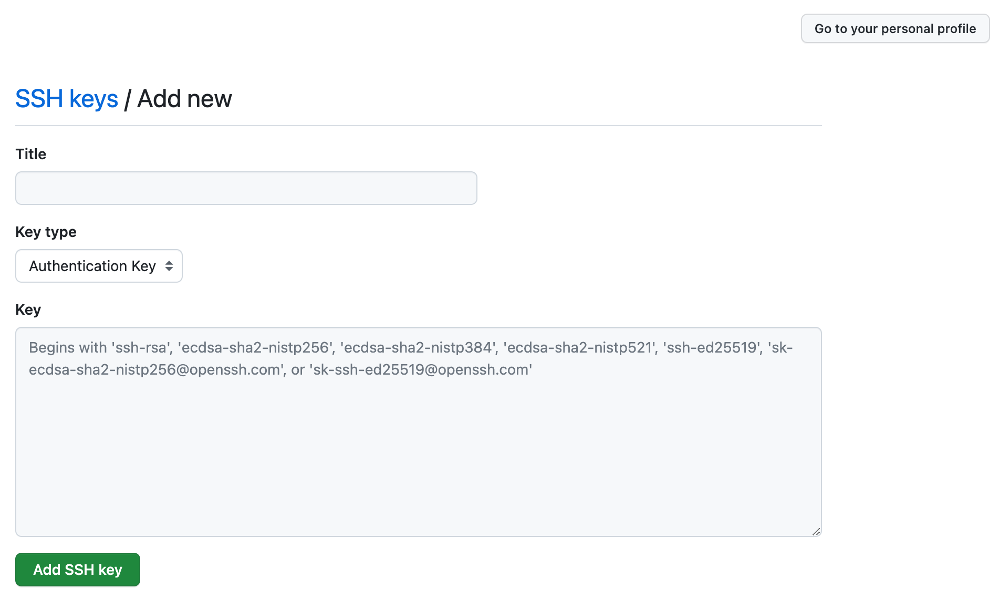

比如现在有两个 GitHub 账户需要在同一台电脑配置，需要按照如下步骤进行

-   `aaa`
-   `bbb`

## 1.生成密钥

```bash

ssh-keygen -t rsa -b 4096 -f ~/.ssh/id_rsa_aaa -C "aaa@gmail.com"

ssh-keygen -t rsa -b 4096 -C ~/.ssh/id_rsa_bbb -C "bbb@gmail.com"
```

运行上述命令后，会在 `~/.ssh/` 文件夹下生成两份密钥，包括公钥及私钥。

-   `id_rsa_aaa`
-   `id_rsa_aaa.pub`
-   `id_rsa_bbb`
-   `id_rsa_bbb.pub`

## 2.将公钥添加至 GitHub 账户的 SSH Key

打开 [GitHub Settings](https://github.com/settings/profile)，之后在 `[Settings] --> [SSH and GPG Keys] --> [New SSH Key]`



## 3.编辑本机 SSH 配置文件

打开 SSH Config 文件 `vim ~/.ssh/config`

```yaml

# aaa
Host github_aaa
    HostName ssh.github.com
    User aaa
    IdentityFile ~/.ssh/id_rsa_aaa

# bbb
Host github_bbb
    HostName ssh.github.com
    User bbb
    IdentityFile ~/.ssh/id_rsa_bbb
```


HostName 对于 GitHub 必须是 `ssh.github.com`，请勿修改！


配置好之后可以通过如下命令测试是否正常

```bash
ssh -T git@github_aaa

ssh -T git@github_bbb
```

正常输出如下

```bash
Hi aaa! You've successfully authenticated, but GitHub does not provide shell access.
```

## 4. Git Repo 配置

首先需要删除 git 配置的全局用户名和邮箱.接着在自己每个项目的仓库中按照需要设置不同的 `user.name` 和 `user.email`.

### 4.1. 删除全局配置

```bash
git config --global --unset 'user.name'
git config --global --unset 'user.email'
```

### 4.2. 每个项目单独设置 local 配置

```bash
git config user.name `xxx`
git config user.email `xxx@xxx.com`
```

## 5.链接 Local Repo 到 Remote Repo


此处的 GitHub repo URL 需要修改下, 不能直接用远端的


```bash
git remote set-url origin git@github_aaa:aaa/test.git


# 远端实际的是, 不要直接使用
git@github.com:aaa/test.git
```

如果显示已经添加, 删除之前的 remote 配置后重新添加

```bash
git remote rm origin
```

验证是否正常

```bash
git remote -v
```

之后就可以进行正常开发，开发完成后使用 `git push origin {branch_name}` 推送。
