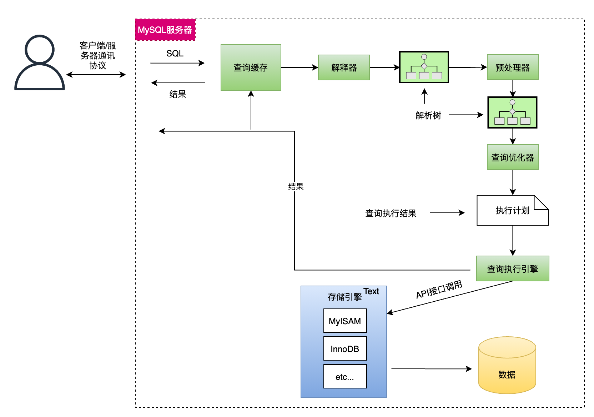

## 1. 什么是死锁？怎么解决？

死锁是指两个或多个事务在同一资源上相互占用，并请求锁定对方的资源，从而导致恶性循环的现象。



-   如果不同程序会并发存取多个表，尽量约定以相同的顺序访问表，可以大大降低死锁机会。
-   在同一个事务中，尽可能做到一次锁定所需要的所有资源，减少死锁产生概率；
-   对于非常容易产生死锁的业务部分，可以尝试使用升级锁定颗粒度，通过表级锁定来减少死锁产生的概率；



如果业务处理不好可以用分布式事务锁或者使用乐观锁

## 2. 隔离级别与锁的关系

-   在 **Read Uncommitted** 级别下，读取数据不需要加共享锁，这样就不会跟被修改的数据上的排他锁冲突
-   在 **Read Committed** 级别下，读操作需要加共享锁，但是在语句执行完以后释放共享锁；
-   在 **Repeatable Read** 级别下，读操作需要加共享锁，但是在事务提交之前并不释放共享锁，也就是必须等待事务执行完毕以后才释放共享锁。
-   **SERIALIZABLE** 是限制性最强的隔离级别，因为该级别锁定整个范围的键，并一直持有锁，直到事务完成。

## 3.MySQL 主从同步延时问题如何解决？

MySQL 实际上在有两个同步机制，一个是半同步复制，用来 解决主库数据丢失问题；一个是并行复制，用来 解决主从同步延时问题。

-   **半同步复制**，也叫 **semi-sync 复制**，指的就是主库写入 `binlog` 日志之后，就会将强制此时立即将数据同步到从库，从库将日志写入自己本地的 `relay log` 之后，接着会返回一个 `ack` 给主库，主库接收到至少一个从库的 `ack` 之后才会认为写操作完成了。

-   **并行复制**，指的是从库开启多个线程，并行读取 `relay log` 中不同库的日志，然后并行重放不同库的日志，这是库级别的并行。

## 4. 一条 SQL 语句的执行过程

-   客户端发送一条查询给服务器。
-   服务器先检查，**查询缓存**，如果命中了缓存，则立刻返回存储在缓存中的结果。否则进入下一阶段。
-   服务器端进行**SQL 解析、预处理**，再由**优化器生成对应的执行计划**。
-   MySQL 根据优化器生成的执行计划，再调用**存储引擎的 API 来执行查询**。
-   将结果返回给客户端。

## 5. 索引

索引是为了加快数据查询的一种数据结构。

从数据结构角度出发，索引分为 **B 树索引**，**B+树**索引，哈希索引和位图索引。 在 MySQL 上，主要是采用 B+树索引，B 树索引在 NoSQL 上使用较多，哈希索引在 KV 数据库上较为常见。

从形态上来说，可以分成覆盖索引，前缀索引，全文索引，联合索引，唯一索引和主键索引。（下面的定义，可以直接一股脑说出来，也可以等面试官问）

-   **覆盖索引**其实是指我们查询的列全部命中了索引；
-   **前缀索引**是指只利用了数据前几个字符的索引，如果前面几个字符区分度不好的话，不建议使用前缀索引；
-   **全文索引**现在比较少用，一般推荐使用别的中间件来完成，例如 ES（小心这一步，可能咔嚓把话题引过去了 ES 上）；
-   **联合索引**是指多个列组成一个索引。创建的时候我们会考虑把区分度好的索引放在前面，因为 MySQL 遵循最左前缀匹配原则；（这里可能会问你啥是最左前缀匹配原则）
-   **唯一索引**是指数据库里面要求该索引值必须要唯一，我们一般用于业务唯一性保证；
-   **主键索引**是比较特殊的索引，一般它的叶子节点要么存储了数据，要么存储了指向数据的指针。MySQL 的 innodb 引擎存储的是数据，MyISAM 放的是数据的地址；
-   从是否存储数据的角度，又可以分为**聚簇索引**和**非聚簇索引**，MySQL 的主键就是聚簇索引，每张表唯一一个，非聚簇索引的数据本质上存储的是主键。

而对于 MySQL 的 innodb 来说，它的行锁是利用索引来实现的，所以如果查询的时候没有索引，那么会导致表锁。

### 5.1. 最左匹配原则

最左前缀匹配原则是指，MySQL 会按照联合索引创建的顺序，从左至右开始匹配。

例如创建了一个联合索引（A，B，C)，那么本质上来说，是创建了 A，（A，B），（A，B，C）三个索引。之所以如此，因为 MySQL 在使用索引的时候，类似于多重循环，一个列就是一个循环。

在这种原则下，我们会优先考虑把区分度最好的放在最左边，而区分度可以简单使用不同值的数量除以总行数来计算（`distinct(a, b, c)/count(\*)`）。

### 5.2. 聚簇索引和非聚簇索引的区别

聚簇索引是指叶子节点存储了数据的索引。MySQL 整张表可以看做是一个聚簇索引。因为非聚簇索引没有存储数据，所以一般是存储了主键。于是会导致一个回表的问题。即如果我们查询的列包含不在索引上的列，这会引起数据库先根据非聚簇索引找出主键，而后拿着主键去聚簇索引里边捞出来数据。而根据主键找数据会引起磁盘 IO，性能大幅度下降。这就是我们推荐使用覆盖索引的原因。

### 5.3. MySQL 为什么使用 B+树索引

MySQL 使用 B+树主要就是考虑三个角度：


B+树的内部结点并没有指向关键字具体信息的指针。因此其内部结点相对 B 树更小。如果把所有同一内部结点的关键字存放在同一盘块中，那么盘块所能容纳的关键字数量也越多。一次性读入内存中的需要查找的关键字也就越多。相对来说 IO 读写次数也就降低了；



由于非终结点并不是最终指向文件内容的结点，而只是叶子结点中关键字的索引。所以任何关键字的查找必须走一条从根结点到叶子结点的路。所有关键字查询的路径长度相同，导致每一个数据的查询效率相当；



B 树在提高了 IO 性能的同时并没有解决元素遍历的我效率低下的问题，正是为了解决这个问题，B+树应用而生。B+树只需要去遍历叶子节点就可以实现整棵树的遍历。而且在数据库中基于范围的查询是非常频繁的，而 B 树不支持这样的操作或者说效率太低；具体可查看[范围查找]。


### 5.4. 为什么使用自增主键

MySQL 的主键是一个聚簇索引，即它的叶子节点存放了数据。 在使用自增主键的情况下，会保证树的分裂照着单方向分裂的，这会大概率导致物理页的分裂也是朝着单方向进行的，即连续的。 在不使用自增主键的情况下，如果在已经满的页里面插入，会导致 MySQL 页分裂，虽然逻辑上页依旧是连续的，但是物理页已经不连续了。 如果在使用机械硬盘的情况下，会导致范围查询经常导致机械硬盘重新定位，性能差。


单方向增长，物理页连续


### 5.5. 索引的缺点

索引的维护是有开销的。在增改数据的时候，数据库都要对应修改索引；而如果索引过多，以至于内存没法装下全部索引，那么会导致访问索引本身都会触发 IO。所以索引不是越多越好。比如*为了避免数据量过大，某些时候我们会使用前缀索引*。

### 5.6. 索引下推

索引下推是指将于索引有关的条件由 MySQL 服务器下推到引擎。例如按照名字存取姓张的，like "张%"。在原来没有索引下推的时候，即便在用户名字上建立了索引，但是还是不能利用这个索引。而在支持索引下推的引擎上，**引擎就可以利用名字索引，将数据提前过滤，避免回表**。目前 innodb 引擎和 MyISAM 都支持索引下推。索引下推和覆盖索引的理念都是一致的，尽量避免回表。

### 5.7. 索引失效

没有使用索引主要有两大类原因，一种是自己 SQL 没写好，例如：

索引列上做了计算
like 关键字用了前缀匹配，例如”%abc“。注意的是，后缀匹配是可以用索引；
字符串没有引号导致类型转换
另一种，则是 MySQL 判断到使用索引的代价很高，比如说要全索引扫描并且回表，那么就会退化成为全表扫描。数据库数据量的大小和数据分布，会影响 MySQL 的决策。

## 6. 事务

在 MySQL 上，innodb 引擎支持事务，但是 MyISAM 不支持事务。innodb 引擎是通过 MVCC 来支持事务的。

### 6.1. MVCC

MVCC，多版本并发控制。innodb 引擎主要是通过 **`undo log` 和事务版本号来实现多版本，利用锁机制来实现并发控制**。

innodb 引擎会给每张表加一个隐含的列，存储的是事务版本号。当修改数据的时候，会生成一条对应的 `undo log`，`undo log` 一般用于事务回滚，里面含有版本信息。简单来说可以认为 `undo log` 存储了历史版本数据。每当发起查询的时候，MySQL 依据隔离级别的设置生成 `Read View`，来判断当前查询可以读取哪个版本的数据。例如，在已提交读的隔离级别下，可以从 `undo log` 中读取到已经提交的最新数据，而不会读取到当前正在修改尚未提交的事务的数据。

而锁机制，对于 innodb 来说，有多个维度：

-   从独占性来说，有排他锁和共享锁；
-   从锁粒度来说，有行锁和表锁；
-   从意向来说，有排他意向锁和共享意向锁；
-   从场景来说，还可以分为记录锁，间隙锁和临键锁；


多版本 = undo log + 事务版本号，并发控制=各种锁


### 6.2. MySQL 的隔离级别

数据库的隔离级别有四种：

-   **未提交读(Read Uncommitted)**：事务可以读取另外一个事务没有提交的数据。 问题：脏读，不可重复读，幻读
-   **提交读(Read Committed)**：事务只能读取到另外一个已经提交的事务数据。 问题： 不可重复度，幻读
-   **重复读(Repeatable Read)**：事务执行过程查询结果都是一致的，innodb 默认级别。 问题： 幻读
-   **串行化(SERIALIZABLE)**：读写都会相互阻塞 问题：

#### MVCC 方向：

innodb 引擎利用了 Read View 来支持提交读和重复读。Read View 里面维护这三个变量：

-   up_limit_id：已提交事务 ID + 1
-   low_limit_id：最大事务 ID + 1
-   txn_ids：当前执行的事务 ID

提交读这个级别，默认读取是不加锁的，只有修改才会加锁。简单来说，已提交读，是每次查询都生成一个新的 Read View，所以永远都能看到已经提交的事务。

可重复读则是在第一次查询生成 Read View 之后，后面的查询都是使用这个 Read View。

#### snapshot isolation 方向：

innodb 引擎的可重复读隔离级别，要比定义的隔离级别更加严苛一点。一般的可重复读，无法解决幻读的问题。比如说原本你事务里面查询订单信息，这个时候又插入了一个新的订单，那么这种时候，幻读就会导致我们下一个查询就会查询到这条记录。但是 innodb 引擎的隔离级别并不会出现这个问题。

因为 innodb 引擎使用了临键锁，在“当前读”，也就是写的时候，锁住了记录之间的空档，防止插入数据。

### 6.3. 共享锁，排它锁

-   共享锁指别的事务可以读，但是不可以写。
-   排他锁，是指别的事务既不可以读也不可以写。

与之非常类似的是，意向共享锁和意向排他锁，事务在获取共享锁或者排他锁之前，要先获得对应的意向锁。意向锁是数据库自己加的，不需要干预。
排它锁和其它三种都互斥；（X 排斥一切） 意向排它锁和意向锁兼容；（IX 兼容 I） 共享锁和共享锁、意向共享锁兼容；（S 兼容 S）

### 6.4. 记录锁，临键锁，间隙锁

记录锁：锁住一行，所以叫做记录锁，也是行锁；
间隙锁：锁住记录之间的间隔，或者索引之前的范围，或者所以之后的范围。只在重复读级别产生，（可以在前面隔离级别的地方提）
临键锁（Next key lock）:记录锁和间隙锁的组合，即锁住记录，又锁住了间隙

### 6.5. innodb 引擎和 MyISAM 引擎的区别

innodb 引擎和 MyISAM 最大的区别是事务、索引、锁支持。

-   innodb 引擎支持事务，而 MyISAM 不支持；
-   innodb 引擎的主键索引的叶子节点存放的是数据本身，而 MyISAM 存储的是数据的地址，需要再一次寻址；
-   innodb 支持行锁，而 MyISAM 只支持表锁，因此 innodb 支持的并发粒度更细更高；

一般来说，在不使用事务，数据修改少而读多的时候，又或者机器比较差的时候，用 MyISAM 比较合适。

### 6.6. 为什么事务提交了但是数据没有保存

在 MySQL 的 innodb 引擎中，事务提交后，必须将数据刷盘到磁盘上，如果在事务提交之后，没来得及刷到磁盘，就会出现事务已经提交，但是数据丢失了。（回到这一步你要开始判断，如果你是主动聊的，那就停下来，等面试官追问；如果这是面试官问的，那就接着答细节）MySQL 的 innodb 引擎，事务提交的关键是将 redo log 写入到 Log buffer，而后 MySQL 调用 write 写入到 OS cache，只有到最后操作系统调用 fsync 的时候，才会落到磁盘上。

过程：`commit -> log buffer -> OS cache -> fsync`

数据库有一个参数 **`innodb_flush_log_at_trx_commit`** 可以控制刷盘的时机：

-   0，写到 log buffer, 每秒刷新；
-   1，实时刷新；
-   2，写到 OS cache, 每秒刷新

Redis 的 AOF 机制也面临类似的问题，即 AOF 也不是立刻刷盘，而是写入到了 OS cache，等到缓冲区填满，或者 Redis 决定刷盘才会刷到磁盘。而 redis 有三种策略控制，always 永远, everysec 每秒, no 不主动。默认情况下 everysec，即有一秒钟的数据可能丢失。

对于大多数要和磁盘打交道的系统来说，都会面临类似的问题，要么选择性能，要么选择强持久性。


提交不等于落盘了，fsync


### 6.7. 什么是 redo log, undo log 和 binlog

-   **redo log** 是 innodb 引擎产生的，主要用于支持 MySQL 事务，MySQL 会先写 redo log，而后在写 binlog。redo log 可以保证即使数据库异常重启，数据也不会丢失
-   **undo log** 是 innodb 引擎产生的，主要时候用于解决事务回滚和 MVCC。数据修改的时候，不仅记录 redo log，也会记录 undo log。在事务执行失败的时候，会使用 undo log 进行回滚；
-   **binlog** 主要用于复制和数据恢复，记录了写入性的操作。binlog 分成基于语句，基于行和混合模式三种复制模式。

因为 redo log 生成到 binlog 写入之间有一个时间差，所以为了保证两者的一致性，MySQL 引入了两阶段提交:

#### 两阶段提交

-   Prepare 阶段，写入 redo log；
-   Commit 阶段，写入 binlog，提交事务；

#### 刷盘时机

-   binlog 刷盘可以通过 sync_binlog 参数来控制。0-系统自由判断，1-commit 刷盘，N-每 N 个事务刷盘
-   redo log 刷盘可以通过参数 innodb_flush_log_at_trx_commit 控制。0-写入 log buffer，每秒刷新到盘；1-每次提交；2-写入到 OS cache，每秒刷盘；

## 参考

-   链接：https://juejin.cn/post/6844903655439597582
