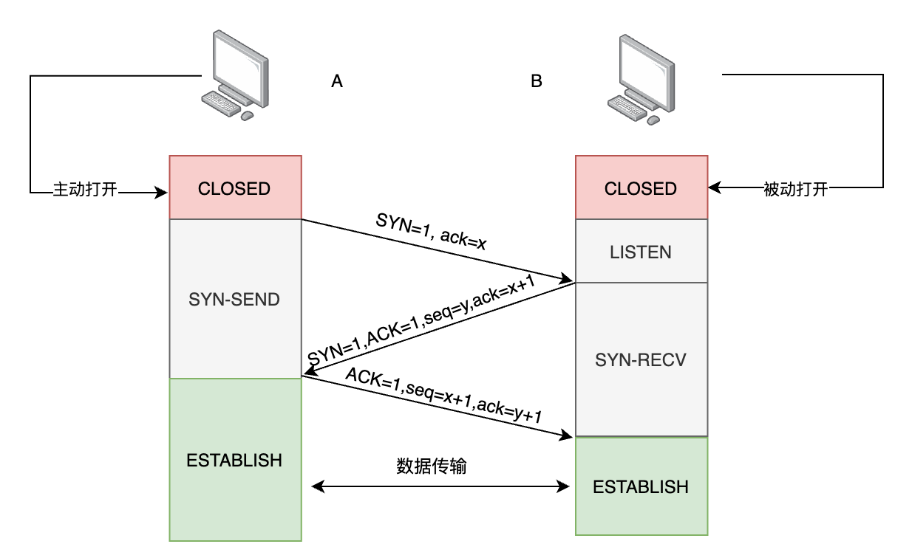
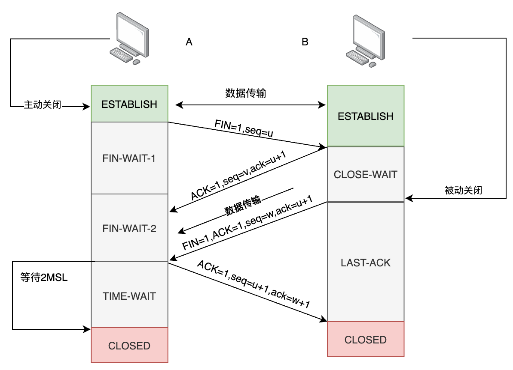
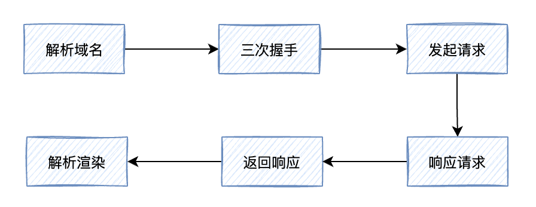

## 1. 网络模型

### 1.1. OSI 七层模型

-   应用层
-   表示层
-   会话层
-   传输层
-   网络层
-   数据链路层
-   物理层

### 1.2. TCP/IP 五层模型

-   **应用层**：为应用程序提供交互服务。在互联网中的应用层协议很多，如域名系统 `DNS`、`HTTP` 协议、`SMTP` 协议等。
-   **传输层**：负责向两台主机进程之间的通信提供数据传输服务。传输层的协议主要有传输控制协议 `TCP` 和用户数据协议 `UDP`。
-   **网络层**：选择合适的路由和交换结点，确保数据及时传送。主要包括 `IP` 协议。
-   **数据链路层**：在两个相邻节点之间传送数据时，**数据链路层将网络层交下来的 `IP` 数据报组装成帧**，在两个相邻节点间的链路上传送帧。
-   **物理层**：实现相邻节点间比特流的透明传输，尽可能屏蔽传输介质和物理设备的差异。

## 2. UDP 协议

**UDP, 用户数据报协议(User Datagram Protocol)**
是无连接的，尽最大可能交付，没用拥塞控制，面向报文（对于应用程序传下来的报文不合并也不拆分，只是添加 UDP 首部），支持一对一、一对多、多对一和多对多的交互通信。

## 3. TCP 协议

**TCP, 传输控制协议(Transmission Control Protocol)**
是 **面向连接** 的，提供 **可靠** 交付，有流量控制，拥塞控制，提供全双工通信，面向 **`字节流`**（把应用层传下来的报文看成字节流，把字节流组织成大小不等的数据块），每一条 TCP 连接只能是点对点的（一对一）。

**特点**：

-   TCP 是面向连接的运输层协议。
-   点对点，每一条 TCP 连接只能有两个端点。
-   TCP 提供可靠交付的服务。
-   TCP 提供全双工通信。
-   面向字节流。

## 3.1. TCP 短连接和长链接

### 3.1.1. 短连接

Client 向 server 发送消息，Server 回应 Client，然后一次读写就完成，双方任何一个都可以发起 close 操作，不过一般都是 client 端操作。短连接一般只会在 Client/Server 间传递一次读写操作。

-   **优点**：管理简单，建立存在的连接都是有用的连接，不需要额外的控制手段。
-   **缺点**：请求频繁，不断的连接以及关闭连接，浪费时间

举例：WEB 网站

### 3.1.2. 长链接

Client 与 Server 完成一次读写之后，它们之间的连接并不会主动关闭，后续的读写操作会继续使用此连接。

-   **优点**：省去了较多的 TCP 的建立与关闭的时间，性能比较好，
-   **缺点**：当连接越来越多时，会压垮服务器；连接管理难度大；安全性能差

举例：QQ、微信、游戏

## 3.2. TCP 流量控制

流量控制是为了控制发送方发送速率，以保证接收方来得及接收。**避免发送方的数据填满了接收方的缓存**。

接收方发送的确认报文中的窗口字段可以用来控制发送窗口大小（`ACK`报文），从而影响发送方的发送速率，将窗口字段设置为 0（即**窗口关闭**），则发送方不能发送数据。

TCP 为每个链接设有一个持续定时器，只要 TCP 连接一方接收到对方的零窗口通知，就启动持续定时器，如果定时器超时，发送窗口探测报文。
**实际上，为了避免此问题产生，发送端主机会时不时地发送一个叫做窗口探测（`Window probe`）的数据段，**，此数据段仅包含一个字节来获取最新的窗口大小信息。

## 3.3. TCP 拥塞控制

在网络上出现拥堵时，如果继续发送大量数据包，可能会导致数据包时延、丢失等，这时 TCP 就会重传数据，但是一重传就会导致网络的负担更重，
于是会导致更大的延迟以及更多的丢包，因此就有了拥塞控制，**目的是避免发送方的数据填满整个网络**。

为了在发送方调节发送数据的量，定义了一个叫做 **拥塞窗口（`cwnd`）** 的概念，会根据网络的拥塞程度动态变化的。没有堵塞，cwnd 增大，出现拥塞，cwnd 减小。

拥塞控制的四个算法：

### 3.3.1. 慢启动

当发送发每收到一个 `ACK`，拥塞窗口 `cwnd` 的大小就会加 1。慢启动算法发包的个数是指数性增长。

但是有一个 **慢启动门限 `ssthresh (slow start threshold)`**，一般来说其大小是 `65536 字节`。

-   当 `cwnd < ssthresh` 时，使用慢启动算法
-   当 `cwnd >= ssthresh` 时，就会使用拥塞避免算法

### 3.3.2. 拥塞避免

进入拥塞避免算法后，它的规则是：每当收到一个 `ACK` 时，`cwnd` 增加 `1/cwnd`。

拥塞避免算法是原本慢启动算法的指数增长变成了线性增长，速度变缓。一直这样增长，网络就会慢慢进入拥塞的状况，出现丢包，这时就会对丢包进行重传。

当触发了**重传机制**，也就进入了 **`拥塞发生算法`**。

### 3.3.3. 拥塞发生

当网络出现拥塞，也就是发送数据包重传，重传机制主要有两种：

-   超时重传
-   快速重传

#### 3.3.3.1. 超时重传时的拥塞发生

此时, `ssthresh` 设为 `cwnd/2`， `cwnd` 重置为 `1`。

这时会重新开始慢启动，慢启动会突然减少数据流的，一旦超时重传，反应强烈，造成网络卡顿。

#### 3.3.3.2. 快速重传时的拥塞发生

TCP 任务认为这种情况不严重，因为大部分没有丢失，则具体变化为

-   `cwnd = cwnd/2`，设为原来的一半；
-   `ssthresh = cwnd` ；
-   进入快速恢复算法

### 3.3.4. 快速恢复

进入快速恢复算法如下：

-   拥塞窗口 `cwnd = ssthresh + 3` （ `3` 的意思是确认有 `3` 个数据包被收到了）；
-   重传丢失的数据包；
-   如果再收到重复的 `ACK`，那么 `cwnd` 增加 `1`；
-   如果收到新数据的 `ACK` 后，把 `cwnd` 设置为第一步中的 `ssthresh` 的值，原因是该 `ACK` 确认了新的数据，说明从 `duplicated ACK` 时的数据都已收到，该恢复过程已经结束，可以回到恢复之前的状态了，也即再次进入拥塞避免状态；


## 4. 三次握手

`三次握手（Three-way handshake）` ,进行三次握手的主要作用就是**为了确认双方的双方的接收能力和发送能力是否正常、指定自己的初始化序列号为后面的可靠性传输做准备**。

假设发送端为客户端，接收端为服务端。开始时客户端和服务端的状态都是 CLOSED。



-   第一次握手：客户端向服务端发起建立连接请求，客户端会随机生成一个起始序列号 x，客户端向服务端发送的字段中包含标志位 SYN=1，序列号 seq=x。第一次握手前客户端的状态为 `CLOSE`，第一次握手后客户端的状态为 `SYN-SENT`。此时服务端的状态为 `LISTEN`。
-   第二次握手：服务端在收到客户端发来的报文后，会随机生成一个服务端的起始序列号 y，然后给客户端回复一段报文，其中包括标志位 SYN=1，ACK=1，序列号 seq=y，确认号 ack=x+1。第二次握手前服务端的状态为 `LISTEN`，第二次握手后服务端的状态为 `SYN-RCVD`，此时客户端的状态为 `SYN-SENT`。（其中 `SYN=1` 表示要和客户端建立一个连接，`ACK=1` 表示确认序号有效）
-   第三次握手：客户端收到服务端发来的报文后，会再向服务端发送报文，其中包含标志位 `ACK=1`，序列号 `seq=x+1`，确认号 `ack=y+1`。第三次握手前客户端的状态为 `SYN-SENT`，第三次握手后客户端和服务端的状态都为 `ESTABLISHED`。**此时连接建立完成**。

### 4.2. 两次握手可以吗？

第三次握手主要为了**防止已失效的连接请求报文段突然又传输到了服务端**，导致产生问题。

-   比如客户端 A 发出连接请求，可能因为网络阻塞原因，A 没有收到确认报文，于是 A 再重传一次连接请求。
-   连接成功，等待数据传输完毕后，就释放了连接。
-   然后 A 发出的第一个连接请求等到连接释放以后的某个时间才到达服务端 B，此时 B 误认为 A 又发出一次新的连接请求，于是就向 A 发出确认报文段。
-   如果不采用三次握手，只要 B 发出确认，就建立新的连接了，**此时 A 不会响应 B 的确认且不发送数据，则 B 一直等待 A 发送数据，浪费资源**。

## 5. 四次挥手



-   A 的应用进程先向其 TCP 发出连接释放报文段（`FIN=1，seq=u`），并停止再发送数据，主动关闭 TCP 连接，进入 `FIN-WAIT-1`（终止等待 1）状态，等待 B 的确认。
-   B 收到连接释放报文段后即发出确认报文段（`ACK=1，ack=u+1，seq=v`），B 进入 `CLOSE-WAIT`（关闭等待）状态，此时的 TCP 处于半关闭状态，A 到 B 的连接释放。
-   A 收到 B 的确认后，进入 `FIN-WAIT-2`（终止等待 2）状态，等待 B 发出的连接释放报文段。
-   B 发送完数据，就会发出连接释放报文段（`FIN=1，ACK=1，seq=w，ack=u+1`），B 进入 `LAST-ACK`（最后确认）状态，等待 A 的确认。
-   A 收到 B 的连接释放报文段后，对此发出确认报文段（`ACK=1，seq=u+1，ack=w+1`），A 进入 `TIME-WAIT`（时间等待）状态。此时 TCP 未释放掉，需要经过时间等待计时器设置的时间 `2MSL`（最大报文段生存时间）后，A 才进入 `CLOSED` 状态。B 收到 A 发出的确认报文段后关闭连接，若没收到 A 发出的确认报文段，B 就会重传连接释放报文段。

### 5.1. 第四次挥手为什么要等待 2MSL？

-   **保证 A 发送的最后一个 ACK 报文段能够到达 B**。这个 `ACK` 报文段有可能丢失，B 收不到这个确认报文，就会超时重传连接释放报文段，然后 A 可以在 `2MSL` 时间内收到这个重传的连接释放报文段，接着 A 重传一次确认，重新启动 2MSL 计时器，最后 A 和 B 都进入到 `CLOSED` 状态，若 A 在 `TIME-WAIT` 状态不等待一段时间，而是发送完 `ACK` 报文段后立即释放连接，则无法收到 B 重传的连接释放报文段，所以不会再发送一次确认报文段，B 就无法正常进入到 `CLOSED` 状态。
-   **防止已失效的连接请求报文段出现在本连接中**。A 在发送完最后一个 `ACK` 报文段后，再经过 2MSL，就可以使这个连接所产生的所有报文段都从网络中消失，使下一个新的连接中不会出现旧的连接请求报文段。

### 5.2. 为什么是四次挥手？

因为当 Server 端收到 Client 端的 `SYN` 连接请求报文后，可以直接发送 `SYN+ACK` 报文。**但是在关闭连接时，当 Server 端收到 Client 端发出的连接释放报文时，很可能并不会立即关闭 SOCKET**，所以 Server 端先回复一个 `ACK` 报文，告诉 Client 端我收到你的连接释放报文了。只有等到 Server 端所有的报文都发送完了，这时 Server 端才能发送连接释放报文，之后两边才会真正的断开连接。故需要四次挥手。

## 6. HTTP

### 6.1. HTTP 协议的特点？

-   HTTP 允许传输**任意类型**的数据。传输的类型由 Content-Type 加以标记。
-   **无状态**。对于客户端每次发送的请求，服务器都认为是一个新的请求，上一次会话和下一次会话之间没有联系。
-   支持**客户端/服务器模式**。

### 6.2. HTTP 报文格式

HTTP 请求由请求行、请求头部、空行和请求体四个部分组成。

-   **请求行**：包括请求方法，访问的资源 URL，使用的 HTTP 版本。`GET` 和 `POST` 是最常见的 HTTP 方法，除此以外还包括 `DELETE、HEAD、OPTIONS、PUT、TRACE`。
-   **请求头**：格式为“属性名:属性值”，服务端根据请求头获取客户端的信息，主要有 `cookie、host、connection、accept-language、accept-encoding、user-agent`。
-   **请求体**：用户的请求数据如用户名，密码等。

**请求报文示例**：

```bash
POST /xxx HTTP/1.1 请求行
Accept:image/gif.image/jpeg, 请求头部
Accept-Language:zh-cn
Connection:Keep-Alive
Host:localhost
User-Agent:Mozila/4.0(compatible;MSIE5.01;Window NT5.0)
Accept-Encoding:gzip,deflate

username=dabin 请求体
```

HTTP 响应也由四个部分组成，分别是：**`状态行、响应头、空行和响应体`**。

-   **状态行**：协议版本，状态码及状态描述。
-   **响应头**：响应头字段主要有 `connection、content-type、content-encoding、content-length、set-cookie、Last-Modified，、Cache-Control、Expires`。
-   **响应体**：服务器返回给客户端的内容。

**响应报文示例**：

```html
HTTP/1.1 200 OK Server:Apache Tomcat/5.0.12 Date:Mon,6Oct2003 13:23:42 GMT
Content-Length:112

<html>
    <body>
        响应体
    </body>
</html>
```

### 6.3. HTTP 状态码有哪些？

| 状态码 | 说明                                   |
| ------ | -------------------------------------- |
| 1x     | 服务器收到请求，需要请求者继续执行操作 |
| 2xx    | 请求正常处理完毕                       |
| 3xx    | 重定向，需要进一步操作已完成请求       |
| 4xx    | 客户端错误                             |
| 5xx    | 服务器处理请求出错                     |

**常见状态码**：

-   **200 OK** 请求正常处理
-   **204 No Content** 请求处理成功：但是没有任何资源返回给客户端(一般用于只需客户端向服务端发送消息)
-   **206 Partial Content** 对资源的某一部分请求：响应报文中包含由 Content-Range 指定范围的实体内容
-   **301 Moved Permanently** 永久重定向：如果把资源对应的 URI 保存为书签，则此时书签会根据 Localtion 首部字段提示的 URI 重新保存
-   **302 Found** 临时重定向：临时地从旧地址 A 跳转到地址 B
-   **303 See Other** 当前请求的资源在其他地址：和 301，302 类似 当使用 post 方法访问一个资源时，把客户端以 get 的方式重定向到对应的 URI，返回 303 状态码
-   **304 Not Modified** 请求资源与本地缓存相同，未修改：资源已经找到，但是不满足条件，所以不把资源返回给客户端。常用于协商缓存。
-   **400 Bad Reqeust** 请求报文内有语法错误
-   **401 Unauthorized** 需要身份认证验证：该状态码表示发送的请求需要通过 HTTP 认证，初次收到 401 响应浏览器弹出认证的对话窗口。若收到第二次 401 状态码，则说明第一次验证失败。
-   **403 Forbidden** 禁止访问：请求资源的访问被服务器拒绝，一般是未获得文件系统的访问权限，访问权限出现问题。
-   **404 Not Found** 服务器上找不到请求资源 或路径错误
-   **405 Method Not Allowed** 不允许的请求方法：请求方法被服务端识别，但是服务端禁止使用该方法。可以用 OPTIONS 来查看服务器允许哪些访问方法
-   **500 Internal Server Error** 服务器端在执行请求时出错：一般是因为 web 应用出现 bug
-   **501 Not Implemented** 服务器不支持的请求方法
-   **502 Bad Gateway** 代理服务器或网关从上游服务器中收到无效响应
-   **503 Service Unavaiable** 服务器暂时处于超负载或停机维护，目前无法处理请求

### 6.4. 一次 HTTP 请求的完整过程

1. 根据域名和 DNS 解析到服务器的 IP 地址（DNS+CDN）
2. 通过 ARP 协议获取 IP 地址对应的物理机器的 MAC 地址
3. 浏览器对服务器发起 TCP **3 次握手**
4. 建立 TCP 连接后发起 HTTP 请求报文
5. 服务器响应 HTTP 请求，将响应报文返回给浏览器
6. 短连接情况下，请求结束则通过 TCP 四次挥手关闭连接，长连接在没有访问服务器的若干时间后，进行连接的关闭
7. 浏览器得到响应信息中的 HTML 代码，并请求 HTML 代码中的资源（js、css、图片等）
8. 浏览器对页面进行渲染呈现给用户

### 6.5. HTTP1.0 和 HTTP1.1 的区别?

-   **长连接**：HTTP1.0 默认使用短连接，每次请求都需要建立新的 TCP 连接，连接不能复用。**HTTP1.1 支持长连接，复用 TCP 连接，允许客户端通过同一连接发送多个请求**。不过，这个优化策略也存在问题，当一个队头的请求不能收到响应的资源时，它将会阻塞后面的请求。这就是“**队头阻塞**”问题。
-   **断点续传**：HTTP1.0 **不支持断点续传**。HTTP1.1 新增了 `range` 字段，用来指定数据字节位置，**支持断点续传**。
-   **错误状态响应码**：在 HTTP1.1 中新增了 24 个错误状态响应码，如 `409(Conflict)` 表示请求的资源与资源的当前状态发生冲突、`410(Gone)` 表示服务器上的某个资源被永久性的删除。
-   **Host 头处理**：在 HTTP1.0 中认为每台服务器都绑定一个唯一的 IP 地址，因此，请求消息中的 URL 并没有传递主机名。到了 HTTP1.1 时代，虚拟主机技术发展迅速，在一台物理服务器上可以存在多个虚拟主机，并且它们共享一个 IP 地址，故 HTTP1.1 增加了 HOST 信息。

### 6.6. HTTP1.1 和 HTTP2.0 的区别？

HTTP2.0 相比 HTTP1.1 支持的特性：

-   **新的二进制格式**：HTTP1.1 基于文本格式传输数据；HTTP2.0 采用二进制格式传输数据，解析更高效。
-   **多路复用**：在一个连接里，允许同时发送多个请求或响应，**并且这些请求或响应能够并行的传输而不被阻塞**，避免 HTTP1.1 出现的”队头堵塞”问题。
-   **头部压缩**，HTTP1.1 的 header 带有大量信息，而且每次都要重复发送；HTTP2.0 把 header 从数据中分离，并封装成头帧和数据帧，**使用特定算法压缩头帧**，有效减少头信息大小。并且 HTTP2.0 **在客户端和服务器端记录了之前发送的键值对，对于相同的数据，不会重复发送。比如请求 a 发送了所有的头信息字段，请求 b 则只需要发送差异数据**，这样可以减少冗余数据，降低开销。
-   **服务端推送**：HTTP2.0 允许服务器向客户端推送资源，无需客户端发送请求到服务器获取。

## 7. HTTPS

### 7.1. 什么是数字证书？

服务端可以向证书颁发机构 CA 申请证书，以避免中间人攻击（防止证书被篡改）。证书包含三部分内容：**证书内容、证书签名算法和签名**，签名是为了验证身份。服务端把证书传输给浏览器，浏览器从证书里取公钥。证书可以证明该公钥对应本网站。

**数字签名的制作过程：**

-   CA 使用证书签名算法对证书内容进行 hash 运算。
-   对 hash 后的值用 CA 的私钥加密，得到数字签名。

**浏览器验证过程：**

-   获取证书，得到证书内容、证书签名算法和数字签名。
-   用 CA 机构的公钥对数字签名解密（由于是浏览器信任的机构，所以浏览器会保存它的公钥）。
-   用证书里的签名算法对证书内容进行 hash 运算。
-   比较解密后的数字签名和对证书内容做 hash 运算后得到的哈希值，相等则表明证书可信。

### 7.2. HTTPS 原理

首先是 TCP 三次握手，然后客户端发起一个 HTTPS 连接建立请求，客户端先发一个 `Client Hello` 的包，然后服务端响应 `Server Hello`，接着再给客户端发送它的证书，然后双方经过密钥交换，最后使用交换的密钥加解密数据。

1. **协商加密算法** 。在 `Client Hello` 里面客户端会告知服务端自己当前的一些信息，包括**客户端要使用的 TLS 版本，支持的加密算法，要访问的域名，给服务端生成的一个随机数（Nonce**）等。需要提前告知服务器想要访问的域名以便服务器发送相应的域名的证书过来。
2. 服务端响应`Server Hello`，告诉客户端服务端**选中的加密算法**。
3. 接着服务端给客户端发来了 2 个证书。第二个证书是第一个证书的签发机构（CA）的证书。
4. 客户端使用证书的认证机构 CA 公开发布的 RSA 公钥**对该证书进行验证**。
5. 验证通过之后，浏览器和服务器通过**密钥交换算法**产生共享的*对称密钥*。
6. 开始传输数据，使用同一个对称密钥来加解密。

### 7.3. HTTPS 与 HTTP 的区别？

-   HTTP 是超文本传输协议，信息是明文传输；HTTPS 则是具有安全性的 ssl 加密传输协议。
-   HTTP 和 HTTPS 用的端口不一样，HTTP 端口是 80，HTTPS 是 443。
-   HTTPS 协议需要到 CA 机构申请证书，一般需要一定的费用。
-   HTTP 运行在 TCP 协议之上；HTTPS 运行在 SSL 协议之上，SSL 运行在 TCP 协议之上。

## 8. DNS 的解析过程？

-   浏览器搜索**自己的 DNS 缓存**
-   若没有，则搜索**操作系统中的 DNS 缓存和 hosts 文件**
-   若没有，则操作系统将域名发送至**本地域名服务器**，本地域名服务器查询自己的 DNS 缓存，查找成功则返回结果，否则依次向**根域名服务器、顶级域名服务器、权限域名服务器**发起查询请求，最终返回 IP 地址给本地域名服务器
-   本地域名服务器将得到的 IP 地址返回给**操作系统**，同时自己也**将 IP 地址缓存起来**
-   操作系统将 IP 地址返回给浏览器，同时自己也将 IP 地址缓存起来
-   浏览器得到域名对应的 IP 地址

## 9. 浏览器中输入 URL 返回页面过程？

-   **解析域名**，找到主机 IP。
-   浏览器利用 IP 直接与网站主机通信，**三次握手**，建立 TCP 连接。浏览器会以一个随机端口向服务端的 web 程序 80 端口发起 TCP 的连接。
-   建立 TCP 连接后，浏览器向主机发起一个 HTTP 请求。
-   服务器**响应请求**，返回响应数据。
-   浏览器**解析响应内容，进行渲染**，呈现给用户。



## 10. Cookie 和 Session 的区别？

-   **作用范围不同**，Cookie 保存在客户端，Session 保存在服务器端。
-   **有效期不同**，Cookie 可设置为长时间保持，比如我们经常使用的默认登录功能，Session 一般失效时间较短，客户端关闭或者 Session 超时都会失效。
-   **隐私策略不同**，Cookie 存储在客户端，容易被窃取；Session 存储在服务端，安全性相对 Cookie 要好一些。
-   **存储大小不同**， 单个 Cookie 保存的数据不能超过 4K；对于 Session 来说存储没有上限，但出于对服务器的性能考虑，Session 内不要存放过多的数据，并且需要设置 Session 删除机制。
