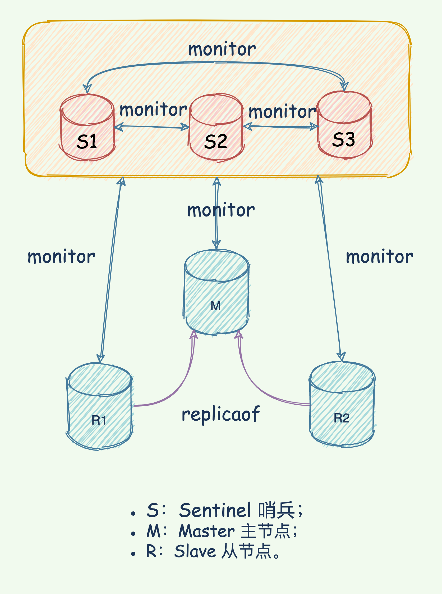

## 1. Redis 是什么

Redis: **Redis** 即 _Remote Dicitionary Server_，可理解为远程数据服务，其是用 C 语言开发的 `key-value` 存储系统。

## 2. Redis 数据类型

Redis 共有八种数据结构，其中包括五种基本数据类型和三种特殊数据类型。

-   `string`：字符串类型，常被用来存储计数器，粉丝数等，简单的分布式锁也会用到该类型
-   `hashmap`：key - value 形式的，value 是一个 map
-   `list`：基本的数据类型，列表。在 Redis 中可以把 list 用作栈、队列、阻塞队列。
-   `set`：集合，不能有重复元素，可以做点赞，收藏等
-   `zset`：有序集合，不能有重复元素，有序集合中的每个元素都需要指定一个分数，根据分数对元素进行升序排序。可以做排行榜
-   `geospatial`：Redis 在 3.2 推出 Geo 类型，该功能可以推算出地理位置信息，两地之间的距离。
-   `hyperloglog`：基数：数学上集合的元素个数，是不能重复的。这个数据结构常用于统计网站的 UV。
-   `bitmap`：bitmap 就是通过最小的单位 bit 来进行 0 或者 1 的设置，表示某个元素对应的值或者状态。一个 bit 的值，或者是 0，或者是 1；也就是说一个 bit 能存储的最多信息是 2。bitmap 常用于统计用户信息比如活跃粉丝和不活跃粉丝、登录和未登录、是否打卡等。

## 3. Redis 为什么这么快

-   完全基于内存，绝大多数请求是纯粹的内存操作，非常迅速；
-   数据结构简单，对数据操作也简单；
-   采用单线程，避免了不必要的上下文切换和竞争条件，也不存在多进程或者多线程导致的切换而消耗 CPU，不用去考虑各种锁的问题，不存在加锁和释放锁的操作，没有因为可能出现的死锁而导致的性能消耗；
-   使用多路 I/O 复用模型，非阻塞 IO。

## 4. Redis 内存淘汰策略

Redis 的 `maxmemory` 支持的内存淘汰机制使得其成为一种有效的缓存方案，成为 memcached 的有效替代方案。

当内存达到 `maxmemory` 后，Redis 会按照 `maxmemory-policy` 启动淘汰策略。

Redis 3.0 中已有淘汰机制

| maxmemory-policy | 含义                 | 特性                                                              |
| ---------------- | -------------------- | ----------------------------------------------------------------- |
| noeviction       | 不淘汰               | 内存超限后写命令会返回错误(如 OOM, del 命令除外)                  |
| allkeys-lru      | 所有 key 的 LRU 机制 | 在 所有 key 中按照最近最少使用 LRU 原则剔除 key，释放空间         |
| volatile-lru     | 易失 key 的 LRU      | 仅以设置过期时间 key 范围内的 LRU(如均为设置过期时间，则不会淘汰) |
| allkeys-random   | 所有 key 随机淘汰    | 一视同仁，随机                                                    |
| volatile-random  | 易失 Key 的随机      | 仅设置过期时间 key 范围内的随机                                   |
| volatile-ttl     | 易失 key 的 TTL 淘汰 | 按最小 TTL 的 key 优先淘汰                                        |

其中 `LRU(less recently used)` 经典淘汰算法在 Redis 实现中有一定优化设计，来保证内存占用与实际效果的平衡，这也体现了工程应用是空间与时间的平衡性。

Redis 中 `LRU` 是近似 `LRU` 实现，并不能取出理想 `LRU` 理论中最佳淘汰 Key，而是通过从小部分采样后的样本中淘汰局部 `LRU` 键。Redis 3.0 中近似 `LRU` 算法通过增加待淘汰元素池的方式进一步优化，最终实现与精确 LRU 非常接近的表现。


精确 `LRU` 会占用较大内存记录历史状态，而近似 `LRU` 则用较小内存支出实现近似效果。


从 Redis4.0 开始，新增 LFU 淘汰机制，提供更好缓存命中率。`LFU(Least Frequently Used)` 通过记录键使用频率来定位最可能淘汰的键。

-   **`volatile-lfu`**：根据 lfu 算法从有过期时间的键删除 (Redis 4.0 中新增)
-   **`allkeys-lfu`**：根据 lfu 算法从所有键删除 (Redis 4.0 中新增)

## 5. 缓存穿透、缓存击穿、缓存雪崩及解决办法

#### 缓存穿透

是指缓存和数据库中都没有的数据，而用户不断发起请求，数据库的自增 ID 都是从 1 开始自增，如果攻击方发起了 ID 为-1 或者 ID 特别大不存在的数据，会导致数据库压力过大，严重的话击垮数据库。



在接口层增加校验，比如用户鉴权校验，参数做校验，不合法的参数直接代码 Return，比如：id 做基础校验，id <=0 的直接拦截等。

-   布隆滤波器
-   返回空对象



#### 缓存击穿

是指一个 key 非常热点，在不停地扛着大并发，大并发集中对这一个点进行访问，当这个 key 在失效的瞬间，持续的大并发就穿破缓存，直接请求数据库，就像在一个完好无损的桶上面凿一个洞。



-   永不过期（热点数据不过期）：直接将缓存设置为不过期，然后由定时任务去异步加载数据，更新缓存。
-   互斥锁：在并发的多个请求中，只有第一个请求线程能拿到锁并执行数据库查询操作，其他的线程拿不到锁就阻塞等待，等到第一个线程将数据写入缓存后，直接走缓存。
    

#### 缓存雪崩

指缓存中不同的数据大批量到过期时间，而查询数据量巨大，请求直接落到数据库上导致宕机。



-   均匀过期（过期时间打散）：既然是大量缓存集中失效，最容易想到的就是让它们不集中生效。可以给缓存的怄气时间加上一个随机值的时间，使得每个 key 的过期时间分布开来，不会集中在同一时刻失效。
-   加互斥锁：对某个 key 只允许一个线程查询数据和写缓存，其他线程等待。
-   缓存永不过期：该方式和缓存击穿一样，着重考虑刷新的时间间隔和数据异常处理。
-   双层缓存策略（二级缓存）：Cache1 为原始缓存，Cache2 为拷贝缓存，Cache1 失效时，可以访问 Cache2，Cache1 缓存失败时间设置为短期，Cache2 设置为长期。
    

## 6. Redis 如何保证缓存和数据库数据的一致性？

新增、更改、删除数据库操作时同步更新 Redis，可以使用事务机制来保证数据的一致性。

一般有四种方案：

-   先更新数据库，后更新缓存：存在问题是并发更新数据库场景下，会将脏数据刷新到缓存中。
-   先更新缓存，后更新数据库：存在问题是并发更新数据库场景下，会将脏数据刷新到缓存中。
-   先删除缓存，后更新数据库：

    -   延时双删：（1）先淘汰缓存
        （2）再写数据库（这两步和原来一样）
        （3）休眠 1 秒，再次淘汰缓存，这么做，可以将 1 秒内所造成的缓存脏数据，再次删除。确保读请求结束，写请求可以删除读请求造成的缓存脏数据。自行评估自己的项目的读数据业务逻辑的耗时，写数据的休眠时间则在读数据业务逻辑的耗时基础上，加几百 ms 即可。
    -   更新与读取操作进行异步串行化

-   先更新数据库，后删除缓存：解决方案就是利用消息队列进行删除的补偿。具体的业务逻辑用语言描述如下：

    -   请求 A 先对数据库进行更新操作
    -   在对 Redis 进行删除操作的时候发现报错，删除失败
    -   此时将 Redis 的 key 作为消息体发送到消息队列中
    -   系统接收到消息队列发送的消息后再次对 Redis 进行删除操作

    这个方案会有一个缺点就是会对业务代码造成大量的侵入，深深的耦合在一起，所以这时会有一个优化的方案，我们知道对 Mysql 数据库更新操作后再 binlog 日志中我们都能够找到相应的操作，那么我们可以订阅 Mysql 数据库的 binlog 日志对缓存进行操作

## 7. Redis 删除过期键的策略

-   **定时过期**：每个设置过期时间的 key 都需要创建一个定时器，到过期时间就会立即清除。该策略可以立即清除过期的数据，对内存很友好；但是会占用大量的 CPU 资源去处理过期的数据，从而影响缓存的响应时间和吞吐量。
-   **惰性过期**：只有当访问一个 key 时，才会判断该 key 是否已过期，过期则清除。该策略可以最大化地节省 CPU 资源，却对内存非常不友好。极端情况可能出现大量的过期 key 没有再次被访问，从而不会被清除，占用大量内存。
-   **定期过期**：每隔一定的时间，会扫描一定数量的数据库的 expires 字典中一定数量的 key，并清除其中已过期的 key。该策略是前两者的一个折中方案。通过调整定时扫描的时间间隔和每次扫描的限定耗时，可以在不同情况下使得 CPU 和内存资源达到最优的平衡效果。

如果 Redis 开启了持久化和主从同步，那么 Redis 的过期处理要复杂一些。

-   在 RDB 之下，加载 RDB 会忽略已经过期的 key；（RDB 不读）
-   在 AOF 之下，重写 AOF 会忽略已经过期的 key；（AOF 不写）
-   主从同步之下，从服务器等待主服务器的删除命令；（从服务器啥也不干）

如果 Redis 开启了主从同步，那么从库对过期 key 的处理，不同版本有不同策略。对于写来说，从库都是等主库的删除命令，但是对于读来说：

-   在 3.2 之前，Redis 从服务器会返回过期 key 的值，仿佛没有过期一样, 可以使用 `TTL` 命令来判断 key 究竟有没有过期。

-   在 3.2 之后，Redis 从服务器会返回 `NULL`，和主库行为一致

## 8. Redis 部署方式

-   **单机模式**：这也是最基本的部署方式,只需要一台机器,负责读写,一般只用于开发人员自己测试
-   **哨兵模式**：哨兵模式是一种特殊的模式，首先 Redis 提供了哨兵的命令，哨兵是一个独立的进程，作为进程，它会独立运行。其原理是哨兵通过发送命令，等待 Redis 服务器响应，从而监控运行的多个 Redis 实例。它具备自动故障转移、集群监控、消息通知等功能。
-   **cluster 集群模式**：在 redis3.0 版本中支持了 cluster 集群部署的方式，这种集群部署的方式能自动将数据进行分片，每个 master 上放一部分数据，提供了内置的高可用服务，即使某个 master 挂了，服务还可以正常地提供。
-   **主从复制**：主从复制这种集群部署模式中，我们会将数据库分为两类，第一种称为主数据库(master)，另一种称为从数据库(slave)。主数据库会负责我们整个系统中的读写操作，从数据库会负责我们整个数据库中的读操作。其中在职场开发中的真实情况是，我们会让主数据库只负责写操作，让从数据库只负责读操作，就是为了读写分离，减轻服务器的压力。

## 9. Sentinel(哨兵)

采用三个哨兵形成集群，三个数据节点（一主两从）方式搭建 Redis 集群

**哨兵主要任务**

Redis 哨兵机制是实现 Redis 不间断服务的高可用手段之一。主从架构集群的数据同步，是数据可靠的基础保障；主库宕机，自动执行主从切换是服务不间断的关键支撑。

Redis 哨兵机制实现了主从库的自动切换：

-   监控 master 与 slave 运行状态，判断是否客观下线；
-   master 客观下线后，选择一个 slave 切换成 master；
-   通知 slave 和客户端新 master 信息。

**哨兵集群原理**

为了避免单个哨兵故障后无法进行主从切换，以及为了减少误判率，又引入了哨兵集群；哨兵集群又需要有一些机制来支撑它的正常运行：

-   基于 pub/sub 机制实现哨兵集群之间的通信；
-   基于 INFO 命令获取 slave 列表，帮助 哨兵与 slave 建立连接；
-   通过哨兵的 pub/sub，实现了与客户端和哨兵之间的事件通知。

主从切换，并不是随意选择一个哨兵就可以执行，而是通过投票仲裁，选择一个 Leader，由这个 Leader 负责主从切换。

### 9.1. 哨兵选举过程

1. 第一个发现该 master 挂了的哨兵，向每个哨兵发送命令，让对方选举自己成为领头哨兵
2. 其他哨兵如果没有选举过他人，就会将这一票投给第一个发现该 master 挂了的哨兵
3. 第一个发现该 master 挂了的哨兵如果发现由超过一半哨兵投给自己，并且其数量也超过了设定的 quoram 参数，那么该哨兵就成了领头哨兵
4. 如果多个哨兵同时参与这个选举，那么就会重复该过程，知道选出一个领头哨兵

选出领头哨兵后，就开始了故障修复，会从选出一个从数据库作为新的 master

## 10. Redis 持久化机制

redis 有两种持久化的方式，**AOF(Append Only File) 和 RDB(Redis DataBase)**.

-   **RDB** 可以理解为是一个快照，直接把 Redis 内存中的数据以快照的形式保存下来。因为这个过程很消耗资源，所以分成 SAVE 和 BG SAVE 两种。BG SAVE 的核心是利用 fork 和 **COW 机制**。
-   **AOF** 是将 Redis 的命令逐条保留下来，而后通过重放这些命令来复原。我们可以通过**重写 AOF** 来减少资源消耗。

### 10.1. BG SAVE 是如何工作的？

BG SAVE 是为了解决 SAVE 资源消耗过多的问题（这一句是点出目标）。BG SAVE 核心是**利用 fork 系统调用，复制出来一个子进程，而后子进程尝试将数据写入文件**。这个时候，子进程和主进程是共享内存的，
当主进程发生写操作，那么就会复制一份内存，这就是所谓的 COW。COW 的核心是利用缺页异常，操作系统在捕捉到缺页异常之后，发现他们共享内存了，就会复制出来一份。

Java 里面也有一大类数据结构，利用了 COW 这种思想，例如 `CopyOnWriteArrayList`，当里面元素变更的时候，就会复制出来一个新的。它特别适合那种大多数情况只是读，只有小部分可能是写的场景。

如果 Redis 的数据也是读多写少，那么 COW 就很高效。这也是一种典型的空间换取时间策略。

### 10.2. COW 有什么缺陷？

有两个缺点：

-   引发缺页异常。如果物理内存紧张，还会引起大量的物理页置换；
-   COW 的存在，导致我们需要预留一部分内存出来，Redis 无法全部利用服务器的内存；

一般来说，最极端情况是所有内存复制一遍，那么 Redis 最多利用一半的内存，考虑到操作系统本身的开销，那么一半都不到。不过如果愿意冒险的话，可以设置超过一半。
例如，不考虑操作系统开销，如果自己的 Redis 读多写少，在整个 BG SAVE 过程，最多复制 10% 的内存，那么就可以给 Redis 分配 80% 的内存。这种搞法，糟糕的情况下，会引发大量的物理页置换，性能下降。所以，很少有人这么使用。

### 10.3. 为什么启用了 AOF 还是会丢失数据？

原因在于 AOF 的数据**只写到了缓存，还没有写到磁盘**。 AOF 有三个选项可以控制刷盘：

-   **always**: 每次都刷盘
-   **everysec**: 每秒，这意味着一般情况下会丢失一秒钟的数据。而实际上，考虑到硬盘阻塞，那么可能丢失两秒的数据。
-   **no**: 由操作系统决定

他们的数据保障逐渐变弱，但是性能变强。所有依赖于 fsync 系统调用落盘的中间件都会碰到类似的问题。例如 redolog, binlog。而且，在 redolog 如果提交事务之后，没有及时落盘，而此时数据库崩掉，就会出现事务已经提交，但是数据依旧丢失的问题。

### 10.4.使用 everysec 策略刷盘有什么缺点？

使用 `everysec` 会面临一个刷盘阻塞的问题。如果数据太多，或者硬盘阻塞，导致一秒钟内无法把所有的数据都刷新到磁盘。Redis 如果发现上一次的刷盘还没结束，就会检查，距离上一次刷盘成功多久了，如果超过两秒，那么 Redis 会停下来等待刷盘成功。

因此**使用 everysec 可能导致丢失两秒数据，而且在同步等待的时候，Redis 的其它请求都被阻塞**。

### 10.5. 为什么 AOF 要引入重写的机制？

AOF 是逐条记录 Redis 执行命令的，这会导致 AOF 文件快速膨胀。在使用 AOF 恢复数据的时候，异常缓慢。从另外一个角度来说，我们也不需要真的逐条记录 Redis 的命令，一些命令是可以合并的。
举例来说，假如我们 Redis 记录了用户 ID 到用户名字的数据，那么某个用户先更新自己的用户名为 AAA，后面更新为 BBB，实际上，我们只需要记录最后一条更新为 BBB 的。又比如说，Redis 先插入了一条数据 AAA，后面又删除了 AAA，这个时候我们可以两条都不记录。

MySQL binlog 类似于 AOF，但是并没有重写机制，因为 MySQL 可以混用 mysqldump 和 binlog 来恢复数据。

### 10.6. AOF 重写是怎么运作的？

重写 AOF 整体类似于 RDB。它并不是读已经写好的 AOF 文件，然后合并。而是类似于 RDB，直接 fork 出来一个子进程，子进程按照当前内存数据生成一个 AOF 文件。在这个过程中，Redis 还在源源不断执行命令，这部分命令将会被写入一个 AOF 的缓存队列里面。当子进程写完 AOF 之后，发一个信号给主进程，主进程负责把缓冲队列里面的数据写入到新 AOF。而后用新的 AOF 替换掉老的 AOF。这里可以看出来，最后这个步骤是比较耗时的，同时 Redis 也处于一种无法执行别的命令的状态。（据我所知是这样的，就是处理缓冲队列的数据的时候，类似于 GC 的 STW 过程，无法对外服务，这也是一个亮点，很少有人会考虑最后这个缓冲队列处理，是不是会导致无法执行用户命令）

这种机制，在别的地方也可以看到。比如说 G1 回收器，使用了 SATB 技术，在开始的时候记录了一个快照，而 GC 过程的引用变更都会丢到一个缓冲队列，在再标记阶段重新处理。

类似于 AOF 这种记录变更的技术，都要面临类似的问题，也就**都需要考虑合并与重写的机制**。

### 10.7.RDB 和 AOF 该如何选择？

选择的原则是：

-   如果数据不能容忍任何丢失，或者只能容忍少量丢失，那么用 AOF；
-   否则 RDB，即一般的数据备份和容灾，RDB 就够了；

遇事不决 AOF，反正 RDB 可以的，AOF 肯定也可以。

### 10.8. Redis 如何利用 RDB 和 AOF 恢复数据？

原则就是，有 AOF 用 AOF，没有就用 RDB。（AOF>RDB，你可以进一步解释为什么）这是因为 AOF 的数据在大概率的情况下，是要比 RDB 新的。这和 MySQL 的数据恢复有点不同。
MySQL 的 **`mysqldump` 类似于 RDB**，而 **`binlog` 类似于 AOF**。MySQL 是可以用 `mysqldump` 的文件来恢复，而后从 binlog 里面找出后续变更，从而恢复数据。

### 10.9. 使用 Redis 来作为分布式锁，会有什么问题？

我们假定你能正确使用 Redis 命令来写一个分布式锁，那么你还需要考虑这个场景：一个线程抢到了分布式锁，然后这个锁没有持久化，然后 Redis 崩了，很快又重启了，结果下一个线程立马就拿到了锁，这个时候就会出现你代码万无一失，但是分布式锁还是被多个线程拿到了的问题。

要考虑分布式锁持久化的问题。假定我一个线程拿到了分布式锁，那么如果这个锁没有被持久化，那么如果 Redis 崩溃立刻重启，那么下一个线程立马就能拿到锁。所以在考虑这种场景下，万无一失的方案，就是开启 AOF 持久化，并且将刷盘时机设置成 always。

## 参考

-   https://juejin.cn/post/6989153296808149029
-   https://segmentfault.com/a/1190000039766545
